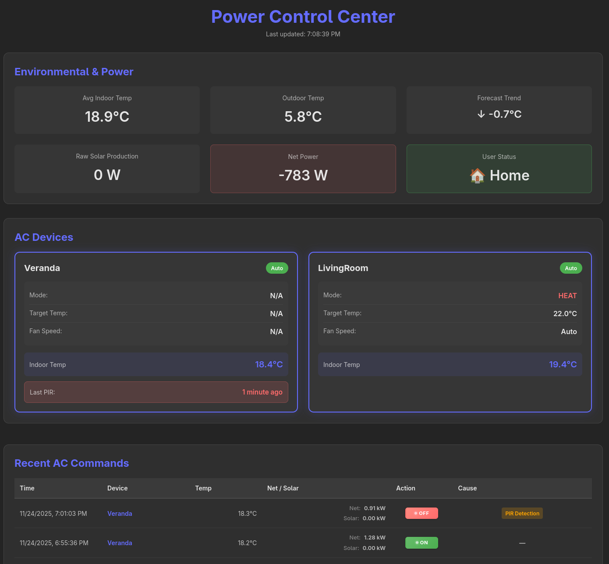
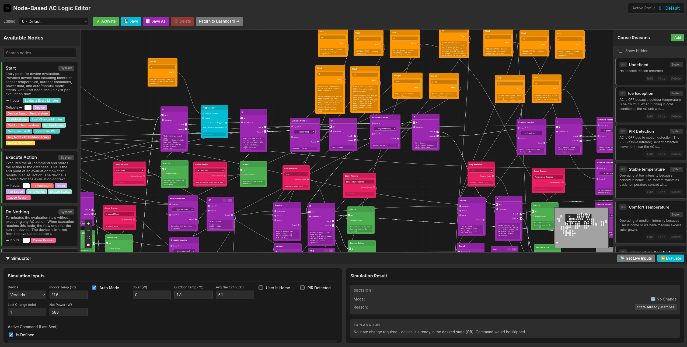

# power-control-center

<a href="https://raw.githubusercontent.com/NotCoffee418/power_control_center/main/preview.png">
  
</a>
<a href="https://raw.githubusercontent.com/NotCoffee418/power_control_center/main/preview2.png">
  
</a>

## About

Power Control Center is a central hub for temperature and power management in your home. It integrates with various ESP32-based devices to monitor and control air conditioning units based on temperature, power consumption, and presence detection. The system provides a unified web dashboard to monitor and manage all connected devices.

## Web Dashboard

The web dashboard is accessible on port 9040 by default. For example: http://raspberrypi.local:9040

## Related Repositories

This system integrates with several ESP32-based devices:

1. **[esp32-ir-airco-controller](https://github.com/NotCoffee418/esp32-ir-airco-controller)** - ESP32 device with temperature sensor and IR emitter to control the airco unit. The repository includes a printable case for the device.

2. **[european_smart_meter](https://github.com/NotCoffee418/european_smart_meter)** - Reads European smart meter to determine current power consumption, and reads the Huawei solar inverter.

3. **[ac-pir-detector](https://github.com/NotCoffee418/ac-pir-detector)** *(optional component)* - ESP32 with PIR sensor to disable AC for a few minutes until presence is no longer detected. Intended to maintain a stable temperature near the outside AC unit while in the area. [Printable case available here](https://github.com/NotCoffee418/arbitrary-3d-models/tree/main/ac_pir_detector_case).

## Installation

### Quick Install (One-liner)

Install the latest release with a single command:

```bash
curl -fsSL https://raw.githubusercontent.com/NotCoffee418/power_control_center/main/installation/install.sh | sudo bash
```

### Manual Installation

1. Download the installation script:
```bash
wget https://raw.githubusercontent.com/NotCoffee418/power_control_center/main/installation/install.sh
chmod +x install.sh
```

2. Run the installer:
```bash
sudo ./install.sh
```

The installer will:
- Detect your system architecture (x86_64, arm64, armv7)
- Download the latest release binary
- Create necessary system user and directories
- Install the systemd service
- Set appropriate permissions

### Post-Installation Configuration

1. Create a configuration file at `/etc/power_control_center/config.json`:
```bash
sudo nano /etc/power_control_center/config.json
```

See the [Configuration](#configuration) section below for detailed information about all available options. You can also reference [config-example.json](config-example.json) for a complete example.

2. Enable and start the service:
```bash
sudo systemctl enable power_control_center
sudo systemctl start power_control_center
```

3. Check the service status:
```bash
sudo systemctl status power_control_center
```

4. View logs:
```bash
sudo journalctl -u power_control_center -f
```

### Supported Architectures
- Linux x86_64
- Linux ARM64 (aarch64)
- Linux ARMv7

## Files
### Config
Config file must be manually created on the device, use config.example.toml as a template.  
Path: `/etc/power_control_center/config.json`

### Database
Database file will be automatically created on the device, if it does not exist.  
Path is defined in config but is quite expected to be at this path.  
Path: `/var/lib/power_control_center/pcc.db`

## API Endpoints

### PIR Detection Endpoints

#### POST /api/pir/detect
Records a PIR (motion) detection event and immediately turns off the corresponding AC device.

**Query Parameters:**
- `device` (required) - The device name (e.g., "Veranda")

**Headers:**
- `Authorization: ApiKey <your_pir_api_key>` or `Authorization: Bearer <your_pir_api_key>`

**Example:**
```bash
curl -X POST "http://localhost:9040/api/pir/detect?device=Veranda" \
  -H "Authorization: ApiKey your_pir_api_key_here"
```

**Behavior:**
- Immediately turns off the AC for the specified device
- Records the detection time
- Prevents the AC from being turned back on for the configured timeout period (default: 5 minutes)

#### POST /api/pir/alive
Receives a keep-alive signal from PIR devices for monitoring purposes.

**Query Parameters:**
- `device` (optional) - The device name

**Headers:**
- `Authorization: ApiKey <your_pir_api_key>` or `Authorization: Bearer <your_pir_api_key>`

**Example:**
```bash
curl -X POST "http://localhost:9040/api/pir/alive?device=Veranda" \
  -H "Authorization: ApiKey your_pir_api_key_here"
```

## Configuration

The configuration file should be created at `/etc/power_control_center/config.json`. See [config-example.json](config-example.json) for a complete example.

### Configuration Fields

```json
{
    "database_path": "/var/lib/power_control_center/pcc.db",
    "listen_address": "0.0.0.0",
    "listen_port": 9040,
    "smart_meter_api_endpoint": "http://raspberrypi.local:9039",
    "ac_controller_endpoints": {
        "LivingRoom": {
            "endpoint": "http://192.168.50.201",
            "api_key": "secret123"
        },
        "Veranda": {
            "endpoint": "http://192.168.50.202",
            "api_key": "secret456"
        }
    },
    "latitude": 51.5074,
    "longitude": -0.1278,
    "pir_api_key": "your_pir_api_key_here",
    "pir_timeout_minutes": 5
}
```

#### Field Descriptions

- **`database_path`**: Path to the SQLite database file. Default: `/var/lib/power_control_center/pcc.db` (recommended to keep default)

- **`listen_address`**: IP address the web server will bind to. Default: `0.0.0.0` (all interfaces, recommended to keep default)

- **`listen_port`**: Port number for the web dashboard. Default: `9040` (recommended to keep default)

- **`smart_meter_api_endpoint`**: URL to your [european_smart_meter](https://github.com/NotCoffee418/european_smart_meter) API endpoint (e.g., `http://your-device-ip:9039`). Configure this based on how you set up the smart meter API.

- **`ac_controller_endpoints`**: Object mapping room names to AC controller configurations. Each entry requires:
  - `endpoint`: URL to the [esp32-ir-airco-controller](https://github.com/NotCoffee418/esp32-ir-airco-controller) device
  - `api_key`: API key for the device (generated through the device's dashboard)

- **`latitude`** and **`longitude`**: Geographic coordinates for your location. Used for solar calculations and automation. You can find your coordinates using Google Maps or similar services.

- **`pir_api_key`**: API key for authenticating [ac-pir-detector](https://github.com/NotCoffee418/ac-pir-detector) requests. This is an arbitrary key that must match what you configured on the PIR device. (optional, defaults to empty/no auth)

- **`pir_timeout_minutes`**: Number of minutes to keep AC off after PIR motion detection. Default: `5` (optional)